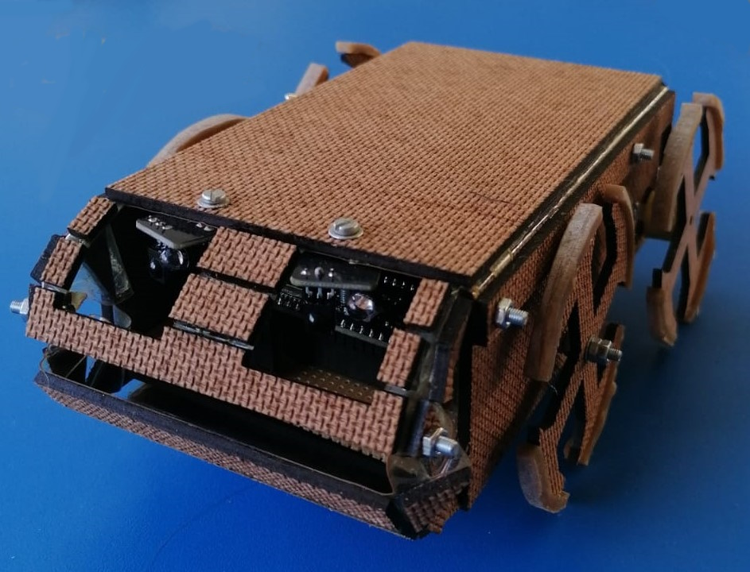

# Toy Origami Bot Insect (TOBI)

This repo details all of the supplementary files for a final-year engineering project.

## Description

Origami is an art form that folds paper into various shapes. These can range from a simple
butterfly to very many complicated patterns such as an intricate dragon. This idea has inspired
an engineering manufacturing technique, where the frame of a robot or other mechanical parts
are made to be assembled from a two-dimensional sheet to a three-dimensional pattern. This
allows for a more cost-effective manufacturing process and allows for easier storage and assembly
of the design. Translating the idea of folding paper to more robust objects can prove difficult
due to the complicated nature of the designs and the specialist equipment often required to
build these origami materials so this process is what the project aims to solve. This will be
done by designing a frame for a legged robot that will be used to entertain a cat. The robot
will need to be able to autonomously navigate a house while avoiding any obstacles in it.

A picture of the final robot made from the closed hardboard frame is found below.

## Contents
### Software

This file contains all the code written for the robot including design algorithms. The following files can be found:

- [OrigamiRobotAvoidance](Software/OrigamiRobotAvoidance.cpp):  The main function created for the robot to allow to avoid objects.
- [CurvedFrameSolver](Software/CurvedFrameSolver.mlx):  The algorithm is designed to be used with the curved frame to get the dimensions to be used for the curve. The height of the body and of the system and the number of segments can be changed to get the correct measurements. These are all assumed to be in mm.

This contains the code used on the ESP32 on the robot to use the object avoidance. It also contains the code used to create a curve of defined curve segments.

### Hardware

This file contains the budget to see all components as well as all the .stl files of the whegs and each frame. This can be exported to pdfs to cut them using a laser cutter. A detailed breakdown of the files is:

- [Budget](Hardware/Budget.xlsx): This file is a spreadsheet of all the components, their prices and where they were acquired from. It also has the power budget done to determine battery requirements.
- [Electronics](Hardware/Electronics):  This folder contains the images needed to build the electronics of the robot. It includes a circuit diagram of the system as well as the veroboard design. The veroboard design includes the pin numbers that were used for the microcontroller.
- [Frames](Hardware/Frames):  This folder contains the stl files of all the frames designed. Although these are 3D, they are meant to be exported to a 2D pattern (top view) to be cut and the depth to the material has been added to show the different material parts. There are 5 designs of which two are made of posterboard and PET (labelled card) and three hardboard and vinyl (labelled wood). These materials each have different frame styles and assembly methods have been recorded in the associated paper.
- [Whegs](Hardware/Whegs):  This folder contains the stl files for the wheg design including the wheel caps for the back whegs and the two different versions that were designed.

## Authors

[Heather Wimberley](https://github.com/Heather-Wimberley)

## License

Open Source Project as long as creators are linked.
